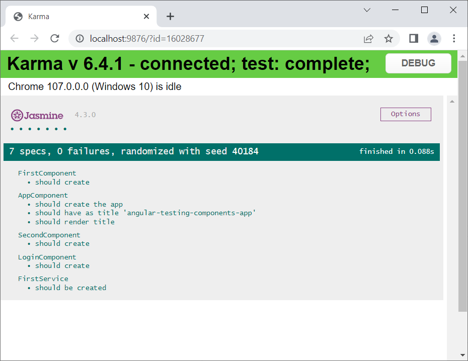

<!-- theme: gaia -->
<!-- backgroundColor: white -->

# Testing Angular Components
<br />
<br />
<br />

#### Vladimir Samoilenko

- Software Architect KMS KIS
- <vladimir.samoilenko@cgm.com>
- [github.com/SamProf](https://github.com/SamProf)
<div style="text-align: end">

 

</div>

<!--
Hi all.
I am ...
We continue our TechTalk course on Angular testing. 
We are doing this as an initiative to improve code quality in our projects.
In the last course, we looked at how to test services and classes.
In today's course, we're going to look at component testing, which is usually seen as a bit more complicated.
Today we won't do any tricks and hacks, just the standard training.
Also today there will be almost no general knowledge, the concentration on the code.
It's interesting to our team. So let's get started!
-->

---

# What do we already know?

## Test structure `*.spec.ts`

```ts
describe('App test component', () => { // group of tests
  let service: MyService;

  beforeEach(() => { // before each test            
    service = new MyService(); // initialize services and variables
  });

  it('should do something', () => { // separate test
    const result = service.sum(2, 4); // Receiving the data, by running the code under test
    expect(result).toBe(5); // Checking the result, using the expect() function
  });
})
```

<!--
To begin, let's review briefly what we learned in the last course. Only what we will need today.
-->

---

# What do we already know?

## Methods for checking expectations toBe

```ts
expect(actual).toBe(expectation);
expect(actual).toEqual(expectation);
expect(actual).toBeDefined();
expect(actual).toBeUndefined();
expect(actual).toBeTruthy();
expect(actual).toBeFalsy();
expect(actual).toBeNull();
expect(actual).toBeGreaterThan(100);
expect(actual).toBeInstanceOf(Type);
expect(actual).toMatch(/^[a-z0-9_\.]+$/);
expect(actual).not.toEqual(expectation)
```

---

# What do we already know?

### TestBed

```ts
beforeEach(() => {
  TestBed.configureTestingModule({
    providers: [
      SimpleService,
      {
        provide: DependencyService,
        useValue: fakeDependencyService
      }
    ]
  });
  service = TestBed.inject(SimpleService);
});
```

---

# What do we already know?

## createSpyObj

```ts
let fakeDepencyService = jasmine.createSpyObj(["method1", "method2"]);

TestBed.configureTestingModule({
  providers: [
    SimpleService,
    {provide: DependencyService, useValue: fakeDepencyService}
  ]
});
service = TestBed.inject(SimpleService);

/// ....
fakeDependencyService.method1.and.returnValue(5);
```

---

# What do we already know?

## spyOn

```ts
it('sum detailed test', () => {
  var checkServiceCheckSpy = spyOn(service, 'sum').and.callThrough();

  var actual = service.sum(2, 4);

  expect(checkServiceCheckSpy).toHaveBeenCalled(2, 4);
});
```
---

# What do we already know?

## Karma interface


---

# Components

1) Testing components is more complicated
2) Сomponent is not only a class code, but also a template
3) Сomponent is always tested inside an environment, a module
4) Changes detection
5) Let's look at the standard generated FirstComponent and AppComponent and test

---

# Component dependency in templates

1) Use `<app-login />` in `AppComponent` template
2) Different modules for application and testing
3) **Solution 1**: add `LoginComponent` to `declarations:[]` of testing module
4) **Solution 2**: use `FakeLoginComponent` implementation
5) **Solution 3**: import module
6) **Solution 4**: schemas: [`NO_ERRORS_SCHEMA`]
7) **Solution 5**: schemas: [`CUSTOM_ELEMENTS_SCHEMA`]


<!-- 
@Component({
    selector: 'app-login',
    template:''
  })
  class FakeLoginComponent{}
-->

---

# Testing component

1) Testing `Input()`
2) Testing of methods of component
3) Testing `Output()`
4) Emit events from template
5) Check parts of rendered component
6) Check classes
7) Mock services dependencies
8) Override component providers

--- 
# Forms
- Using standard FormBuilder to do form testing

---
# Thank you

- Source code and slides
- [github.com/SamProf/angular-testing-components-app](https://github.com/SamProf/angular-testing-components-app)
